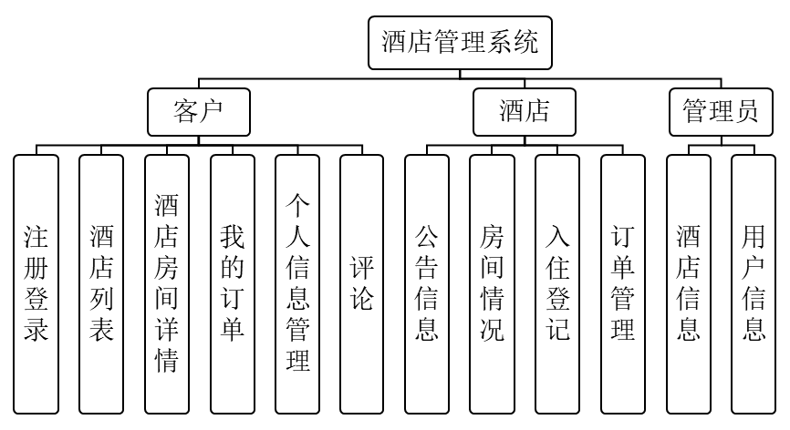
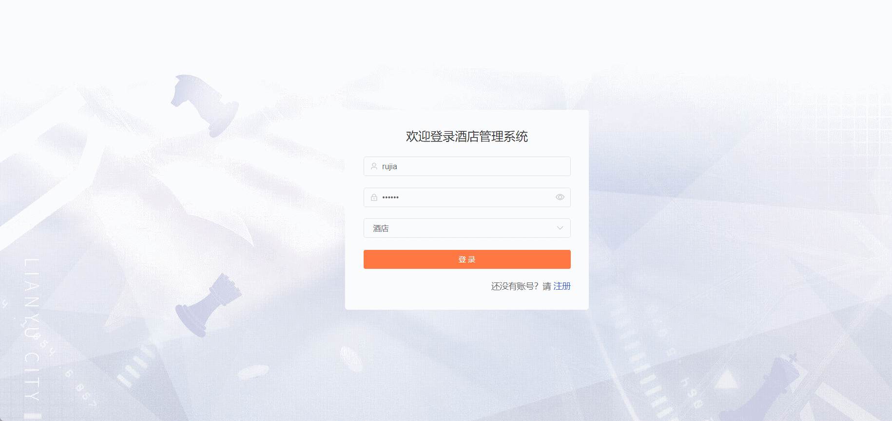

# hotel-management🎂

基于SpringBoot+Vue的酒店管理系统

## 介绍🌞

> 在旅游业的繁荣浪潮中，酒店行业正迎来业务量的持续飙升。面对这一挑战与机遇，数字化转型对酒店而言，不仅是提升竞争力的关键，更是顺应时代潮流的必然选择。审视现状，传统酒店管理系统在服务质量、客户响应速度和成本控制等方面已显露出力不从心。因此，寻求一种全面且高效的酒店管理系统变得至关重要。为此，我们凭借Spring Boot和Vue的强大组合，精心打造了一款前沿的酒店管理系统。该系统采用前后端分离的架构，后端基于Spring Boot，它以其高效、稳定、安全的特点，为后端业务逻辑的实现和数据处理提供了坚实支撑，同时结合MySQL数据库，构建了一个高效、可靠的数据管理层，确保数据的实时性和准确性。而前端方面，我们选用了Vue作为开发框架，结合Element UI组件库，精心打造了一个用户友好、操作简便的界面。这一界面不仅具备响应式布局，能够适应各种终端设备，还通过丰富的交互效果，提升了用户体验。无论是酒店管理者还是客户，都能在这个平台上享受到高效、便捷的服务。
>
> 这款系统不仅仅是一个管理工具，更是酒店提升运营效率、优化客户体验的得力助手。它充分利用了现代互联网技术的优势，实现了酒店管理的自动化和智能化。通过这套全面的解决方案，酒店可以在激烈的市场竞争中脱颖而出，赢得更多的客户信任和支持。

## 软件架构🌞



## 项目演示🌞

> 管理员


> 酒店管理员



> 普通用户


## 安装教程🌞

```
1. 运行环境准备mysql8 + java8 + node14.16.1

2. 配置maven路径，加载依赖

3. 运行sql文件，确保application.yml或config.properties的数据库名称和账号密码是数据库所在主机的账号密码
```


## 使用说明🌞

```
1. 登入

	管理员账号：admin	密码：123456

	客户账号：zhangsan	密码：123456

	酒店账号：rujia 密码：123456
  
2. 运行流程

SpringBoot+Vue项目的部署详情可以查看这篇CSDN博客：http://t.csdnimg.cn/kpuxS

前后端不分离项目的部署流程可以查看这篇CSDN博客：http://t.csdnimg.cn/CslA5
```


## CSDN项目合集🌞

点击前往：http://t.csdnimg.cn/Q4u84


## 联系我🌞

**有偿获取完整源码或调试代码**

🐧：1902317191

we-chat：coding1902317191
